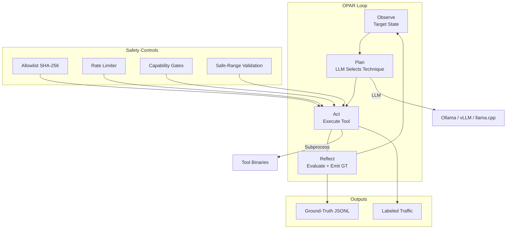

# Athena Agents

AI offensive agent framework for autonomous security testing. Implements the OPAR (Observe/Plan/Act/Reflect) execution loop with configurable LLM backends, tool registry, safety controls, and ground-truth telemetry emission.

## Quick Start

```bash
# Install Python orchestrator
pip install -e .

# Run against a target (requires config directory + Ollama running)
python -m orchestrator --target juice-shop --config-dir ./config

# Run with ICS capabilities
ATHENA_CAPABILITIES=ICS_WRITE,CAN_INJECT python -m orchestrator --target openplc --config-dir ./config
```

In production, this runs inside the `nexus-athena` container via the entrypoint script. See [nexus-athena](https://github.com/acald-creator/nexus-athena) for container deployment.

## Architecture



## Components

| Directory | Purpose |
|-----------|---------|
| `orchestrator/` | Python OPAR loop, LLM interface, safety controls |
| `orchestrator/agent.py` | Core `AgentOrchestrator` class |
| `orchestrator/__main__.py` | CLI entrypoint for container execution |
| `orchestrator/llm/` | LLM backend interface (Ollama, vLLM, llama.cpp) |
| `orchestrator/tool_registry.py` | TOML-based tool catalog with capability gates |
| `orchestrator/allowlist.py` | SHA-256 verified target allowlist |
| `orchestrator/rate_limiter.py` | Token-bucket rate limiting |
| `orchestrator/ground_truth.py` | Labeled telemetry emission (JSONL) |
| `orchestrator/traffic_labeling.py` | HTTP headers + env vars for SOC filtering |
| `orchestrator/ics_safety.py` | ICS/OT safe-range boundary validation |
| `crates/` | Rust tool binaries (compiled into nexus-athena image) |
| `crates/athena-modbus/` | Modbus TCP client (read, write, enumerate, fuzz) |
| `crates/athena-canbus/` | CAN Bus operations (craft, inject, sniff, replay, fuzz) |
| `crates/athena-common/` | Shared ICS types |
| `eval/` | Evaluation metrics (coverage, compliance) |
| `config/` | Reference configs (tool-registry, targets) — lives in nexus-athena for deployment |

## Safety Controls

All autonomous execution enforces:

| Control | How |
|---------|-----|
| Allowlist | SHA-256 hash of `allowlist.json` verified before every cycle |
| Capability gates | Tools declare required caps; only available if active profile provides them |
| Rate limiting | Per-target token-bucket (configured in target TOML) |
| Safe ranges | ICS write values validated against min/max before network transmission |
| Traffic labeling | `X-Athena-Scenario`, `X-Athena-Scenario-Id`, `X-Athena-Run-ID` on outbound HTTP |
| Human review | `needs_review` flag halts execution for analyst approval |
| Max actions | Configurable limit (1-1000) prevents runaway |

## LLM Backends

Configured via `config/llm.toml`:

| Backend | Best for | Config |
|---------|----------|--------|
| Ollama | Local dev, fast iteration | `type = "ollama"`, model = "llama3:8b" |
| vLLM | GPU nodes, high-quality planning | `type = "vllm"`, model = "llama3:70b" |
| llama.cpp | Air-gapped, edge deployment | `type = "llamacpp"`, model path to GGUF |

The `OLLAMA_HOST` env var overrides the URL in `llm.toml`.

## Ground-Truth Output

Every action emits a JSONL record:

```json
{
  "scenario_id": "uuid",
  "run_id": "uuid",
  "timestamp": "2026-08-18T14:00:05Z",
  "target": "juice-shop.lab",
  "technique": "T1190",
  "tool": "http-request",
  "label": "malicious",
  "payload_family": "sqli"
}
```

Labels: `malicious`, `benign_control`, `failed_attack`, `successful_simulation`, `needs_review`, `scenario_complete`

## Development

```bash
# Install with dev dependencies
pip install -e ".[dev]"

# Run tests
pytest

# Run linter
ruff check .

# Build Rust crates (requires Rust toolchain)
cargo build --workspace --release
```

## Rust Crates

| Crate | Binary | Purpose |
|-------|--------|---------|
| `athena-modbus` | `athena-modbus` | Modbus TCP operations (FC01-FC16 + enumeration + fuzzing) |
| `athena-canbus` | `athena-canbus` | CAN Bus via SocketCAN (craft, inject, sniff, replay, fuzz) |
| `athena-common` | (library) | Shared ICS types and serialization |
| `athena-scanner` | `athena-scanner` | Network reconnaissance |
| `athena-fuzzer` | `athena-fuzzer` | Protocol fuzzing engine |
| `athena-crafter` | `athena-crafter` | Packet crafting |

Binaries are compiled into the nexus-athena Docker image via the `rust-builder` stage.

## Cross-Repo Integration

| Repository | Relationship |
|------------|-------------|
| `nexus-athena` | Container runtime — builds and runs this code |
| `core-nexus` | Architecture docs, API Gateway consumes ground-truth |
| `nexus-webtop-soc` | SOC stack detects the traffic this agent generates |

## License

[MIT License](LICENSE)
